# Proyecto IoT: ESP32 LED RGB con MQTT y Servidor Web
**Autores:**   Edward Fabian Goyeneche Velandia / Juan Sebastian Giraldo Duque  

**Nombre de la Práctica:** Proyecto IoT: ESP32 LED RGB con MQTT y Servidor Web  

**Curso:**  Desarrollo de Sistemas IoT 

**Departamento:**  Departamento de Ingeniería Electrica, Electronica y Computacion  

**Universidad:**  Universida Nacional de Colombia - Sede Manizales 

---
Esta es la guia para realizar la demo de  un sistema Iot basico donde un ESP32-C6 controla un LED RGB (LED interno) que cambia de colores cada 3 segundos, envía la información por MQTT a un servidor en AWS EC2, y una página web muestra los cambios de color en tiempo real.


##  Componentes de la Demo

- **ESP32-C6-DevKitC-1 v1.2** con LED RGB WS2812 integrado
- **Servidor AWS EC2** con Ubuntu
- **Broker MQTT Mosquitto** con soporte WebSocket
- **Servidor Web Apache** 
- **Página Web** con visualización en tiempo real

##  Arquitectura de la Demo

```
ESP32-C6 ──(WiFi)──> Internet ──> AWS EC2 Server
    │                                │
    └─ LED RGB WS2812               ├─ Mosquitto MQTT (puerto 1883)
                                    ├─ WebSocket MQTT (puerto 9001)
                                    └─ Apache Web (puerto 80)
                                           └─ Página Web
```

---

#  Guía  Paso a Paso

## Parte 1: Configuración del Servidor AWS EC2

### 1. Crear Instancia EC2

#### 1.1 **Acceder a AWS Console**:
   - Ve a [AWS Console](https://aws.amazon.com/console/)
   - Navega a **EC2 > Instances**

  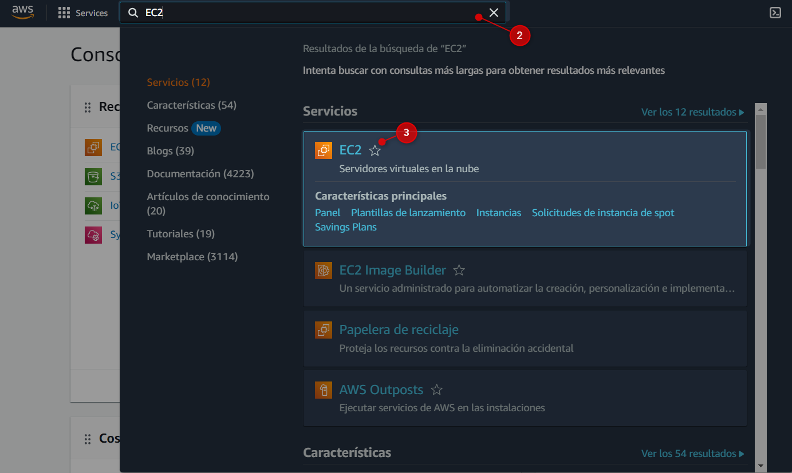

#### 1.2 **Lanzar Nueva Instancia**:
   - Click en **"Launch Instance"**
   
  


   - **Name**: `esp-webserver`

   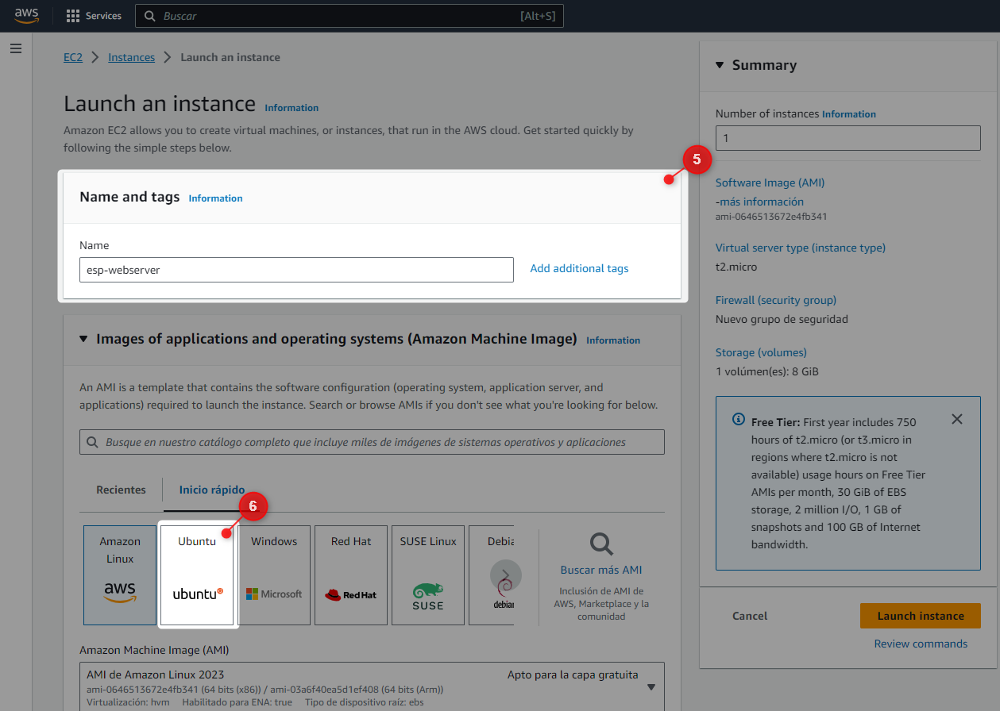

   - **AMI**: Ubuntu Server 22.04 LTS (Free tier eligible)
   - **Instance Type**: t2.micro (Free tier eligible)

#### 1.3 **Configurar Security Groups**:
   - **SSH (22)**: Tu IP (para acceso remoto)
   - **HTTP (80)**: 0.0.0.0/0 (para la página web)

  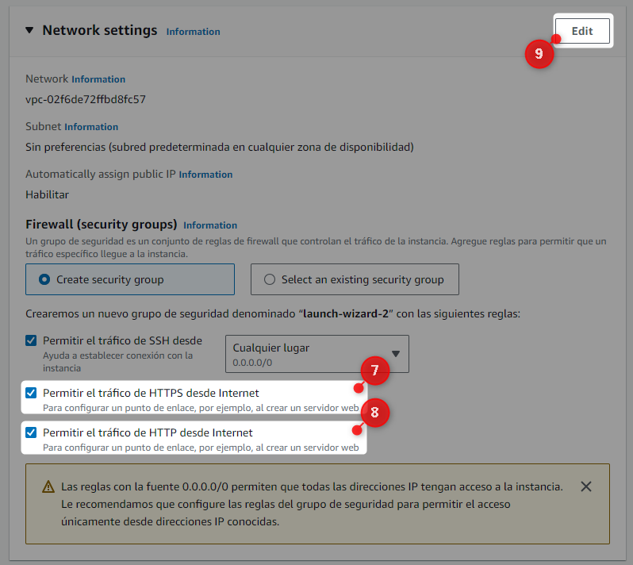

   - **MQTT (1883)**: 0.0.0.0/0 (para el ESP32)
   - **WebSocket (9001)**: 0.0.0.0/0 (para la página web)

   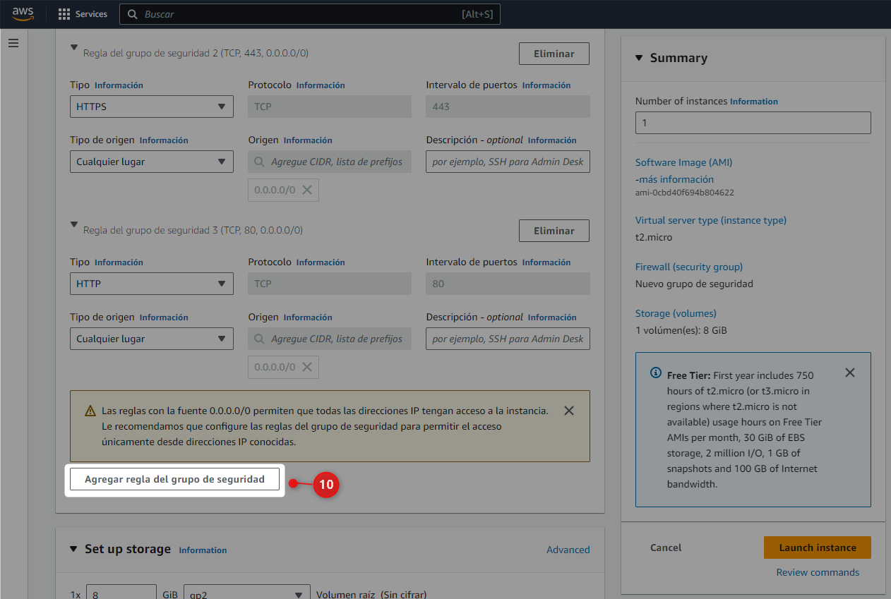

   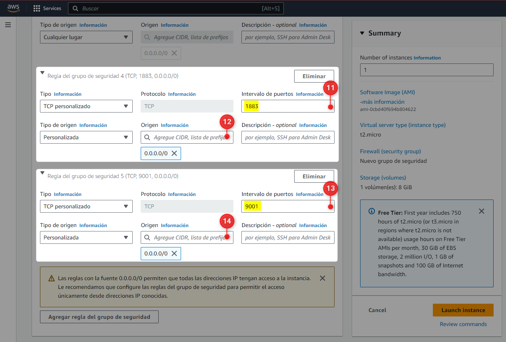

#### 1.4 **Configurar Key Pair**:

  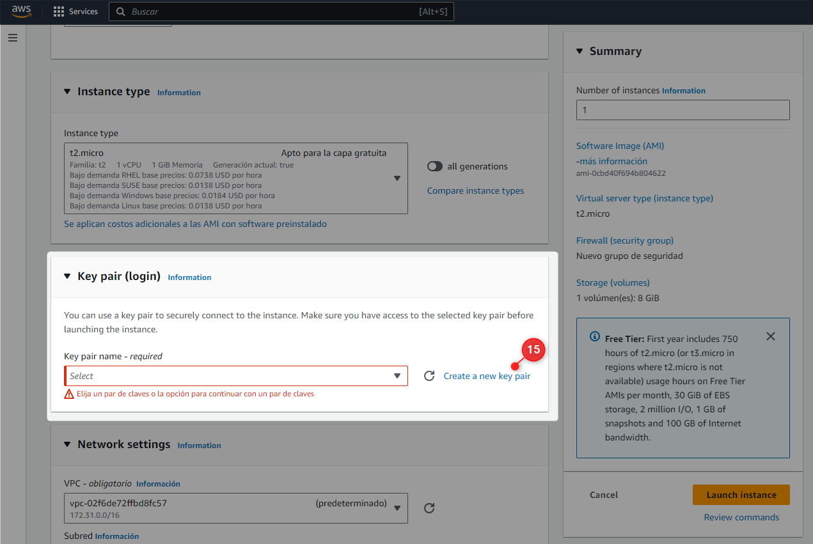
   - Crear nuevo Key Pair o usar existente


   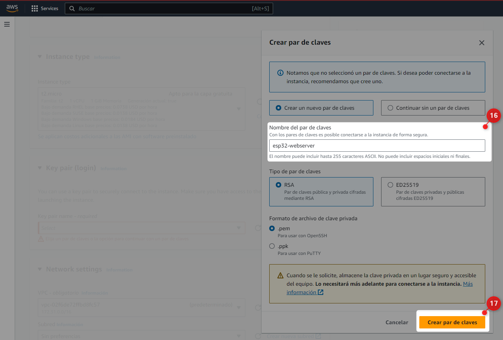


   - Descargar archivo `.pem` para acceso SSH


   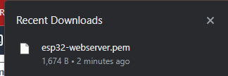


#### 1.5 **Lanzar Instancia** y anotar la **IP pública**

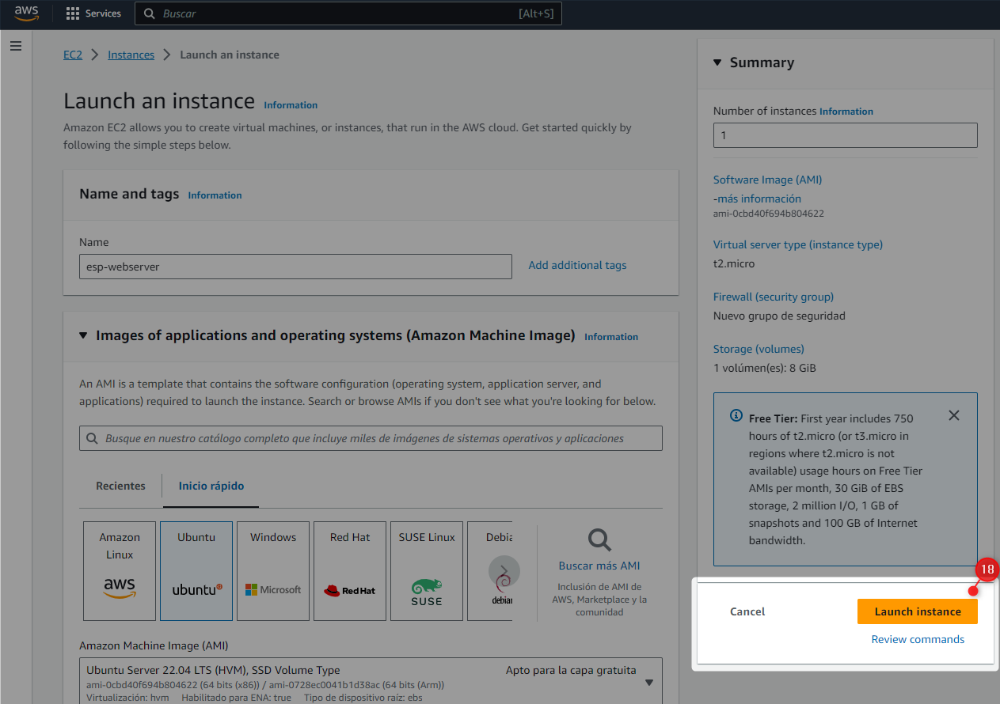

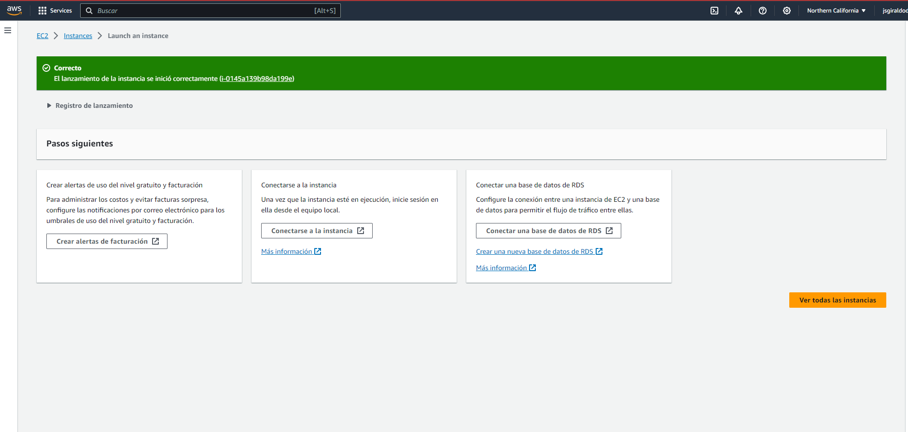


# Parte 2: Conectar al Servidor
Abrir la ruta donde se guardó el archivo  `.pem` para acceso SSH y ejecutar los siguientes comandos
```bash
# Cambiar permisos del archivo .pem
chmod 400 key-descargada.pem

# Conectar por SSH
ssh -i key-descargada.pem ubuntu@IP_PUBLICA_SERVER
```
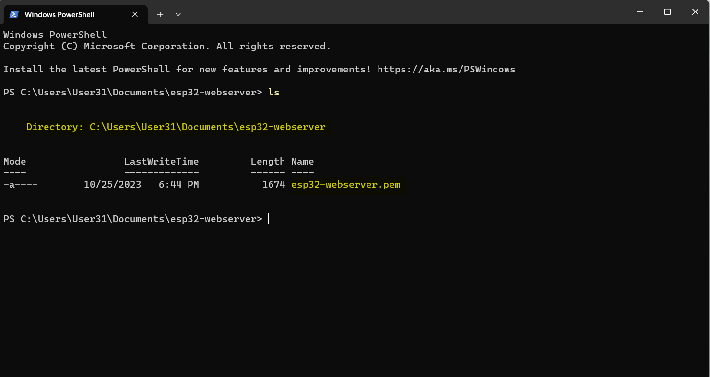
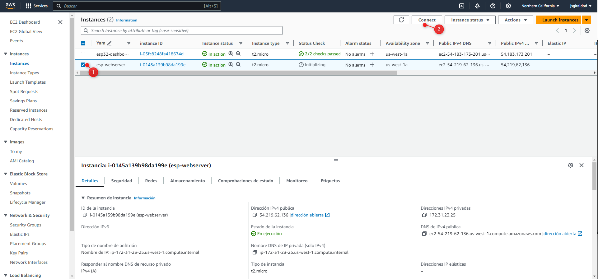
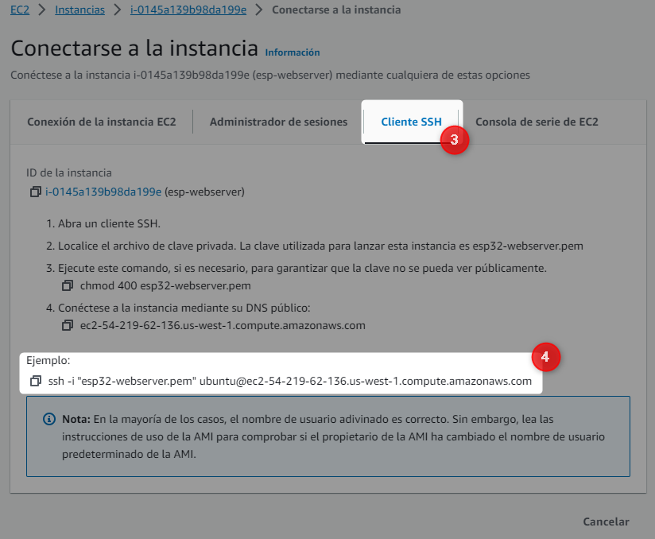
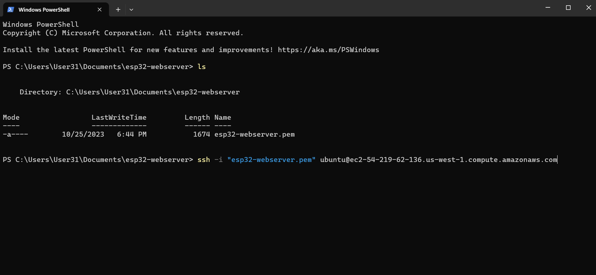
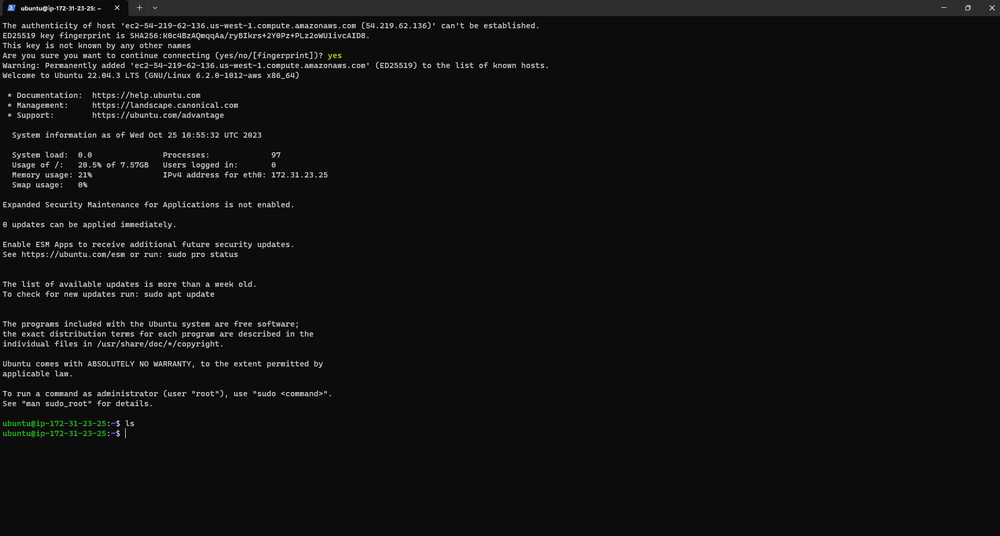

## **2 Actualizar Sistema**

#### **2.1 instalar apache**

Si aún no  se tiene Apache instalado, se puede hacer  usando el gestor de paquete apt, abriendo  una terminal y ejecutar estos comandos


```bash
sudo apt update
sudo apt install apache2
```

Una vez instalado, Apache debería iniciarse automáticamente, y su página de inicio predeterminada estará disponible en tu servidor.

#### **2.2 Crear la estructura de directorios**

Por convención, las páginas web se almacenan en el directorio **/var/www/hmtl**. se puede utilizar este directorio para uba página web sencilla. Puedes crear un directorio para el sitio y cambiar los permisos para que puedas editar los archivos:

```bash
sudo mkdir /var/www/html/mi-sitio
sudo chown -R tu_usuario:tu_usuario /var/www/html/mi-sitio
```

Reemplaza **`tu_usuario`** con tu nombre de usuario.


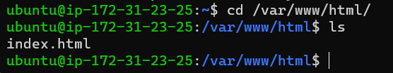


#### **2.3 Comprobar el Estado del Servidor**

Se debe asegúrar de que Apache esté en ejecución. Puedes verificar su estado con el siguiente comando:

```bash

sudo systemctl status apache2

```

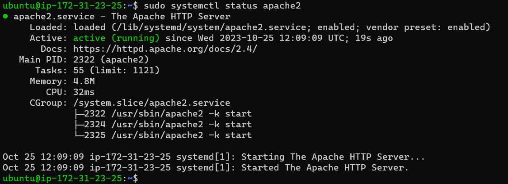

Si Apache no se está ejecutando, se debe iniciar el servicio con:

```bash

sudo systemctl start apache2

```

#### **2.4 Accede a tu página web**
Ahora, puedes acceder a la página web en un navegador web utilizando la dirección IP del servidor. 

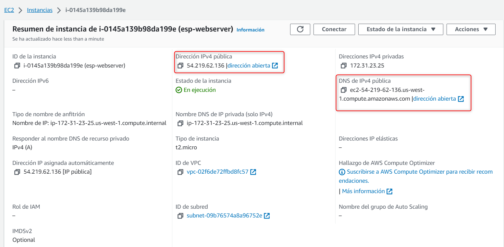

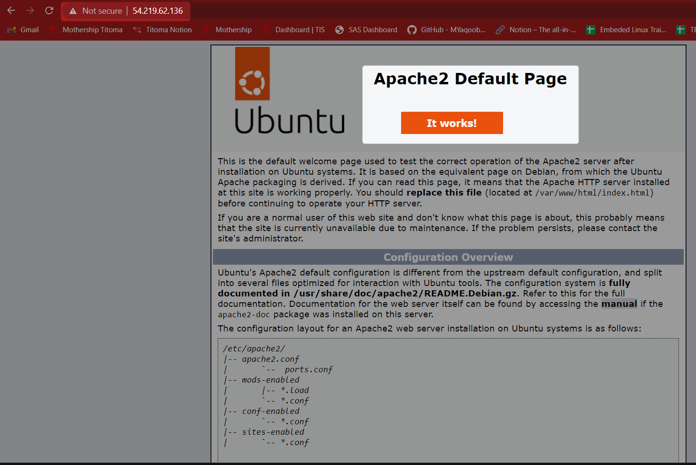

**Importante:** El servidor predeterminado no admite HTTPS, así que asegúrese de iniciar sesión mediante HTTP.


### Mosquitto Server. (MQTT)

Para crear un servidor MQTT en Ubuntu, se puede  utilizar el popular servidor MQTT llamado Mosquitto. Mosquitto es de código abierto y ampliamente utilizado en la comunidad de IoT y desarrollo de aplicaciones que requieren comunicación de mensajes entre dispositivos.   asi de debe de instalar y configurar Mosquitto en Ubuntu:

#### Paso 1: Instalar Mosquitto

```bash

sudo apt update
sudo apt install mosquitto mosquitto-clients

```

Abrir una terminal y ejecuta los siguientes comandos para instalar Mosquitto en el sistema:

Estos comandos actualizarán la lista de paquetes disponibles y luego instalarán el servidor Mosquitto y la utilidad de línea de comandos Mosquitto Clients.

#### Paso 2: Iniciar y Habilitar el Servicio

Una vez que Mosquitto esté instalado, se puede habilitar el servicio y se debe de asegurar de que se inicie automáticamente al arrancar el sistema con los siguientes comandos:

```bash

sudo systemctl enable mosquitto
sudo systemctl start mosquitto

```

#### Paso 3: Comprobar el Estado del Servidor

Para verificar si Mosquitto se está ejecutando correctamente ejecutando el siguiente comando:

```bash

sudo systemctl status mosquitto

```

Se deberia ver un mensaje que indique que el servicio está activo y en funcionamiento.

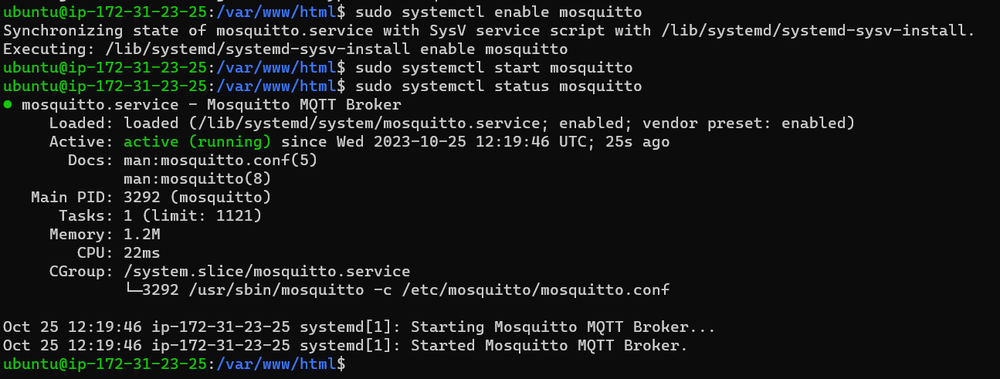

#### Paso 4: Configurar el Servidor (Opcional)

La configuración predeterminada de Mosquitto generalmente es suficiente para un uso básico. Sin embargo, si  se desea personalizar la configuración, se puede editar el archivo de configuración principal de Mosquitto:

```bash

sudo nano /etc/mosquitto/conf.d/mosquitto.conf

```

Realiza las modificaciones que desees y guarda el archivo.

```bash
listener 1883
protocol mqtt

listener 9001
protocol websockets

password_file /etc/mosquitto/passwd
allow_anonymous false
```

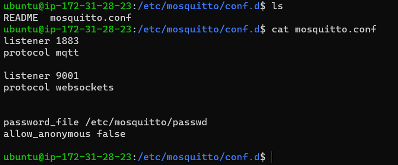

#### **2.5 Crear un archivo de contraseñas:**

- Abrir una terminal y ejecuta el siguiente comando para crear un archivo que almacene los usuarios y contraseñas:

```bash

sudo mosquitto_passwd -c /etc/mosquitto/passwd <nombre-de-usuario>

```

Reemplazar **`<nombre-de-usuario>`** con el nombre de usuario que  se desee. Será solicitado a ingresar una contraseña para ese usuario.

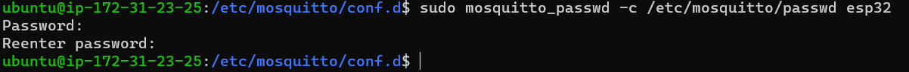

```bash
sudo chown mosquitto:mosquitto /etc/mosquitto/passwd
sudo chmod 640 /etc/mosquitto/passwdclear
```

#### **2.6 Reiniciar el servidor Mosquitto para que los cambios surtan efecto:**

```bash

sudo systemctl restart mosquitto

```

Ahora, cuando te conectes al servidor MQTT Mosquitto, deberás proporcionar un nombre de usuario y contraseña válidos para autenticarte.

#### **2.7 Prueba el Servidor**

Puedes utilizar el cliente Mosquitto para probar la funcionalidad del servidor MQTT. Abre una terminal y utiliza el siguiente comando para suscribirte a un tema y ver los mensajes que llegan:

```bash

mosquitto_sub -h localhost -t test -u esp32 -P esp32
musqu

```

Abrir otra terminal y publica un mensaje en el mismo tema:

```bash

mosquitto_pub -h localhost -t test -m "Hola, MQTT!" -u esp32 -P esp32

```

Deberías ver el mensaje "Hola, MQTT!" en la terminal donde te suscribiste al tema.

### Test Client MQTT.

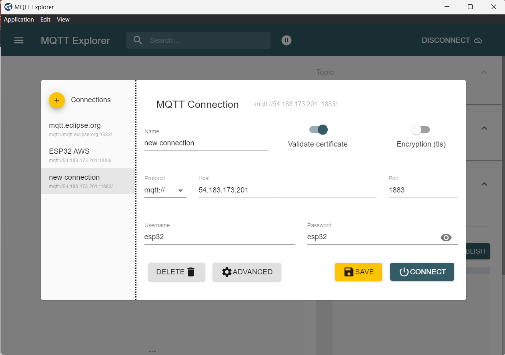
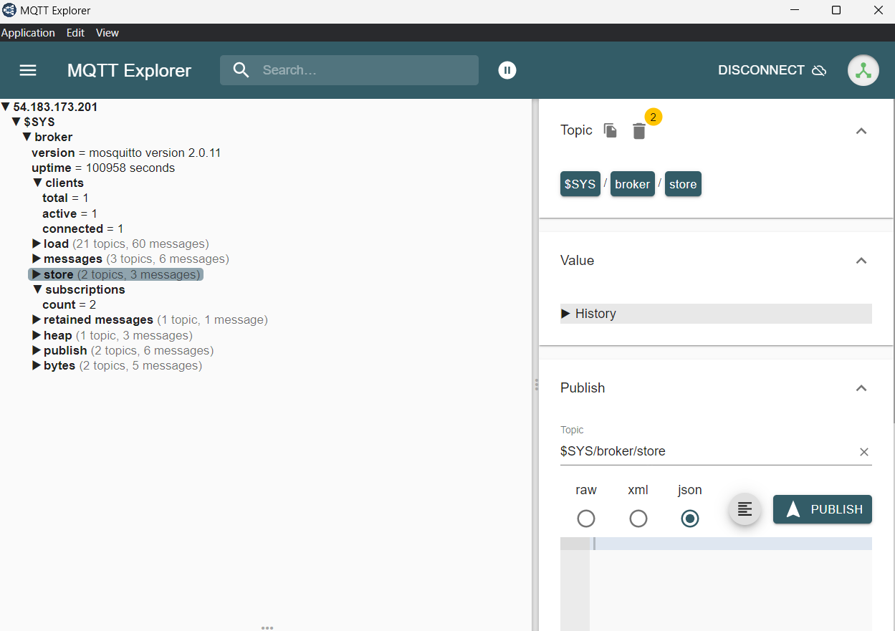


## Parte 3: Moficacion del archivo index.html

Para  la aplicacion a desarrollar  se debe colocar este  codigo HTML de la parte web para  vizualizacion  de la informacion, este se coloca en la siguiente ruta:

```bash

sudo nano /var/www/html/index.html

```
**Contenido del archivo:**
```html
<!DOCTYPE html>
<html lang="es">
<head>
  <meta charset="UTF-8">
  <title>ESP32 LED Monitor</title>
  <style>
    body { font-family: Arial, sans-serif; text-align: center; margin-top: 40px; }
    #circle {
      width: 120px;
      height: 120px;
      border-radius: 50%;
      background: #222;
      margin: 0 auto 20px auto;
      box-shadow: 0 0 20px #888;
      transition: background 0.5s;
    }
    #status {
      margin: 20px 0;
      font-weight: bold;
    }
    .connected { color: green; }
    .disconnected { color: red; }
    .connecting { color: orange; }
  </style>
</head>
<body>
  <h2>ESP32 LED Monitor</h2>
  <div id="circle"></div>
  <div id="status" class="connecting">Conectando a MQTT...</div>
  <div>Color actual: <span id="colorText">---</span></div>
  <div>Mensajes recibidos: <span id="messageCount">0</span></div>

  <script src="https://cdnjs.cloudflare.com/ajax/libs/paho-mqtt/1.0.1/mqttws31.min.js"></script>
  <script>
    window.onload = function() {
      const brokerHost = "IP_PUBLICA_SERVER"; // CAMBIAR  LA IP
      const brokerPort = 9001;
      const topic = "esp32/led";
      const username = "esp32";
      const password = "12345678";

      const colorMap = {
        red: "#ff0000",
        green: "#00ff00",
        blue: "#0000ff"
      };

      let messageCount = 0;
      let client = new Paho.MQTT.Client(brokerHost, brokerPort, "webclient_" + Math.random().toString(16).substr(2, 8));

      client.onConnectionLost = function(responseObject) {
        console.log("Conexión perdida: " + responseObject.errorMessage);
        document.getElementById('status').textContent = "Desconectado de MQTT";
        document.getElementById('status').className = "disconnected";
      };

      client.onMessageArrived = function(message) {
        console.log("Mensaje recibido: " + message.payloadString);
        const color = message.payloadString.toLowerCase();
        messageCount++;
        
        document.getElementById('colorText').textContent = color;
        document.getElementById('messageCount').textContent = messageCount;
        document.getElementById('circle').style.background = colorMap[color] || "#222";
      };

      const connectOptions = {
        userName: username,
        password: password,
        timeout: 10,
        keepAliveInterval: 30,
        onSuccess: function() {
          console.log("Conectado exitosamente a MQTT broker");
          document.getElementById('status').textContent = "Conectado a MQTT";
          document.getElementById('status').className = "connected";
          client.subscribe(topic);
          console.log("Suscrito al topic: " + topic);
        },
        onFailure: function(error) {
          console.log("Error de conexión: " + error.errorMessage);
          document.getElementById('status').textContent = "Fallo la conexión MQTT: " + error.errorMessage;
          document.getElementById('status').className = "disconnected";
        }
      };

      console.log("Intentando conectar a: " + brokerHost + ":" + brokerPort);
      client.connect(connectOptions);
    };
  </script>
</body>
</html>
```

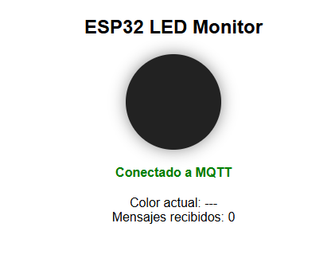

* Ir a ```http://IP_PUBLICA_SERVER/index.html ```
* Debería mostrar la página con estado "Conectando a MQTT..."

## Parte 4: Configuración del Proyecto ESP32

#### 4.1 Prerequisitos

- **ESP-IDF v5.5** instalado
- **ESP32-C6-DevKitC-1 v1.2**
- **Cable USB-C**

#### 4.2 Estructura del Proyecto

El proyecto ya está configurado con los archivos necesarios:

```
main/
├── CMakeLists.txt           # Configuración de dependencias
├── idf_component.yml        # Dependencia led_strip
├── Kconfig.projbuild        # Configuración del proyecto
└── station_example_main.c   # Código principal
```

#### 4.3 Configurar Variables en el Código

Editar `main/station_example_main.c` y cambiar las siguientes líneas:

```c
// Configuración WiFi - CAMBIAR POR TUS DATOS
#define EXAMPLE_ESP_WIFI_SSID      "RED_WIFI"
#define EXAMPLE_ESP_WIFI_PASS      "PASSWORD_WIFI"

// Configuración MQTT - CAMBIAR POR TU IP
#define MQTT_BROKER_URL "mqtt://_IP_PUBLICA_SERVER:1883"
```

⚠️ **IMPORTANTE**: Reemplazar:
- `RED_WIFI`: Nombre de tu red WiFi
- `PASSWORD_WIFI`: Contraseña de tu red WiFi  
- `IP_PUBLICA_SERVER`: IP pública de tu servidor AWS EC2

#### 4.4 Compilar y Flashear

```bash
# Configurar target para ESP32-C6
idf.py set-target esp32c6

# Configurar proyecto (opcional)
idf.py menuconfig

# Compilar
idf.py build

# Conectar ESP32 por USB y flashear
idf.py flash

# Monitor serial para ver logs
idf.py monitor
```

#### 4.5 Configuración de Red (opcional)

Si prefieres configurar WiFi mediante menuconfig:

```bash
idf.py menuconfig
```

Navegar a: **Example Configuration** y establecer:
- WiFi SSID
- WiFi Password

---

## 🧪 Verificación del Sistema

### 1. Verificar ESP32

**En el monitor serial (`idf.py monitor`) deberías ver:**
```
I (2450) ESP32_MQTT_LED: Connected to WiFi SSID:RED_WIFI
I (2460) ESP32_MQTT_LED: Got IP: 192.168.x.x
I (2470) ESP32_MQTT_LED: MQTT Broker: mqtt://IP_PUBLICA_SERVER:1883
I (2890) ESP32_MQTT_LED: MQTT Connected
I (2900) LED: Color: ROJO REAL - LED RGB encendido por 3 segundos
I (5910) LED: Color: VERDE REAL - LED RGB encendido por 3 segundos
I (8920) LED: Color: AZUL REAL - LED RGB encendido por 3 segundos
```

**LED RGB físico debe:**
- Cambiar colores cada 3 segundos: Rojo → Verde → Azul
- Mostrar colores puros y brillantes

### 2. Verificar Servidor MQTT

```bash
# En el servidor AWS, monitorear mensajes en tiempo real
mosquitto_sub -h localhost -t esp32/led -u esp32 -P 12345678
```

**Deberías ver:**
```
red
green
blue
red
green
blue
...
```

### 3. Verificar Página Web

- Ir a `http://TU_IP_PUBLICA/index.html`
- **Estado**: "Conectado a MQTT" (verde)
- **Círculo**: Debe cambiar de color sincronizado con el ESP32
- **Contador**: Debe incrementar con cada mensaje
- **Color actual**: Debe mostrar "red", "green", "blue"

---


## 📊 Diagrama de Flujo del Sistema

```
Inicio
  ↓
Inicializar NVS
  ↓
Conectar WiFi
  ↓
Inicializar LED RGB
  ↓
Conectar MQTT
  ↓
Crear Tarea LED
  ↓
Loop infinito:
  ├─ Cambiar color LED (rojo/verde/azul)
  ├─ Publicar color por MQTT
  ├─ Esperar 3 segundos
  ├─ Apagar LED brevemente
  └─ Repetir con siguiente color
```

---


### Servidor
- **Cloud Provider**: AWS EC2
- **OS**: Ubuntu 22.04 LTS
- **Broker MQTT**: Mosquitto
- **Web Server**: Apache2
- **Puertos**: 22 (SSH), 80 (HTTP), 1883 (MQTT), 9001 (WebSocket)

---


