# ESP32C6 Parking Monitor

**Autor:** Felipe Idárraga Quintero

**Nombre de la Práctica:** Práctica 1

**Curso:** Desarrollo de Sistemas IoT

**Departamento:** Departamento de Ingeniería Electrica, Electronica y Computacion

---

## Descripción de la práctica

Este repositorio contiene una práctica titulada **ESP32C6 Parking Monitor**, cuyo objetivo es implementar un sistema básico de monitoreo de parqueaderos usando un **ESP32-C6**. 

En este proyecto los sensores de parqueo no son físicos, sino que se simulan en el firmware: el ESP32-C6 genera de forma aleatoria (con una probabilidad configurada) si cada puesto está libre u ocupado, imitando la entrada y salida de vehículos. Estos estados se envían por MQTT y se muestran en una página web sencilla que permite ver en tiempo real la ocupación del parqueadero.

Este trabajo es una adaptación del proyecto original **“Proyecto IoT: ESP32 LED RGB con MQTT y Servidor Web”** de los autores **Edward Fabian Goyeneche Velandia** y **Juan Sebastian Giraldo Duque**, que se encuentra en https://github.com/Edward1304/Demo_IoT_MQTT_SERVER. 

A partir de esa base se realizaron cambios en la lógica, en el manejo de MQTT y en la interfaz web para orientarlo al monitoreo de parqueaderos con ESP32-C6 y sensores simulados.

## Componentes de la práctica

- **ESP32-C6-DevKitC-1 v1.2** con LED RGB WS2812 integrado
- **Servidor AWS EC2** con Ubuntu
- **Broker MQTT Mosquitto** con soporte WebSocket
- **Servidor Web Apache** 
- **Página Web** con visualización en tiempo real

##  Arquitectura IoT
```bash
ESP32-C6 ──(WiFi)──> Internet ──> AWS EC2 Server
    │                                │
    └─ LED RGB WS2812               ├─ Mosquitto MQTT (puerto 1883)
                                    ├─ WebSocket MQTT (puerto 9001)
                                    └─ Apache Web (puerto 80)
                                           └─ Página Web
```

En la arquitectura IoT, el ESP32-C6 actúa como cliente MQTT conectado por WiFi al router, el cual da acceso a un servidor AWS EC2 que aloja el broker Mosquitto y el servidor web Apache2. El dashboard web se sirve vía HTTP y se comunica en tiempo real con el broker mediante MQTT sobre WebSocket

## Implementación del sistema

### 1. Creación y configuración del servidor EC2 en AWS

**1.1 Creación de la cuenta y acceso a EC2**

Primero, ingresa a **Amazon Web Services (AWS)** y crea una cuenta (puede ser con la capa gratuita).  
Luego accede a la **AWS Management Console** y, en la barra de búsqueda, escribe **“EC2 (Amazon Elastic Compute Cloud)”**. 

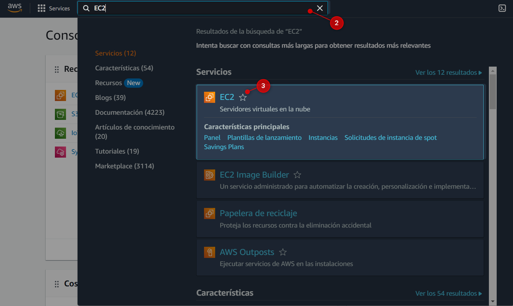

Dentro del servicio EC2 selecciona la opción **“Launch instance”** para crear una nueva instancia.

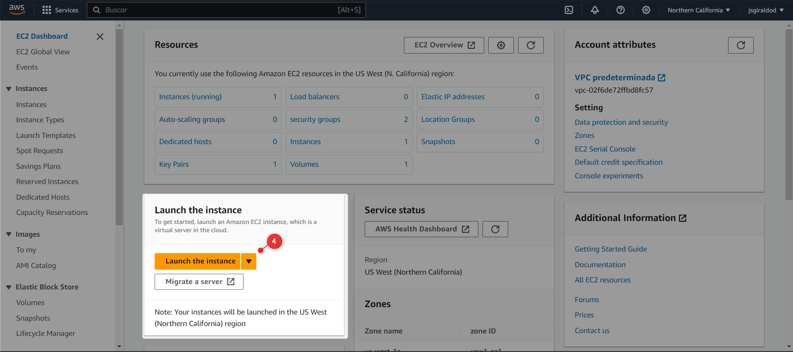

**1.2 Configuración de la instancia EC2**

Al crear la instancia, se le puede asignar un nombre descriptivo, por ejemplo **esp-webserver**.  
Como **Amazon Machine Image (AMI)** se selecciona **Ubuntu Server 22.04 LTS**, y como **Instance Type** se elige **t3.micro**, que es compatible con la capa gratuita de AWS y suficiente para alojar el broker MQTT (Mosquitto) y el servidor web (Apache2) de esta práctica.

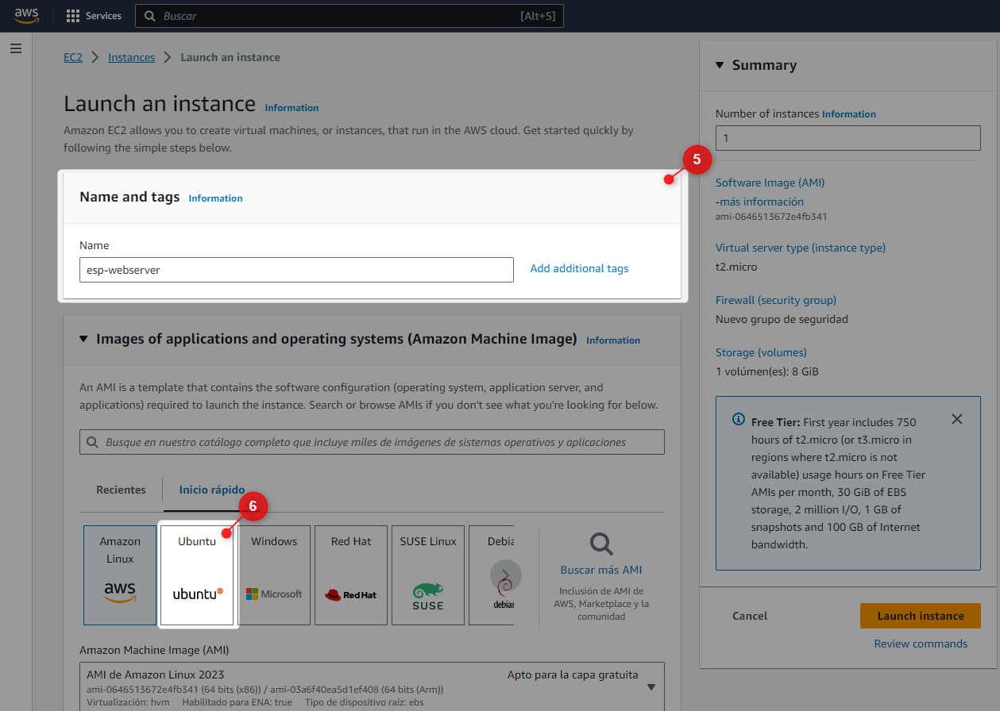

**1.3 Configuración del grupo de seguridad (Security Group)**

En **Network settings**, selecciona la opción **“Create security group”** y configura las siguientes reglas de entrada:

- **SSH** desde `0.0.0.0/0`: permite conectarse por SSH a la instancia desde cualquier dirección IP.  

- **HTTP** desde Internet: permite acceder al servidor web por el puerto 80.

- **HTTPS** desde Internet: permite acceder por el puerto 443 (si se desea acceder al servidor web por este puerto).

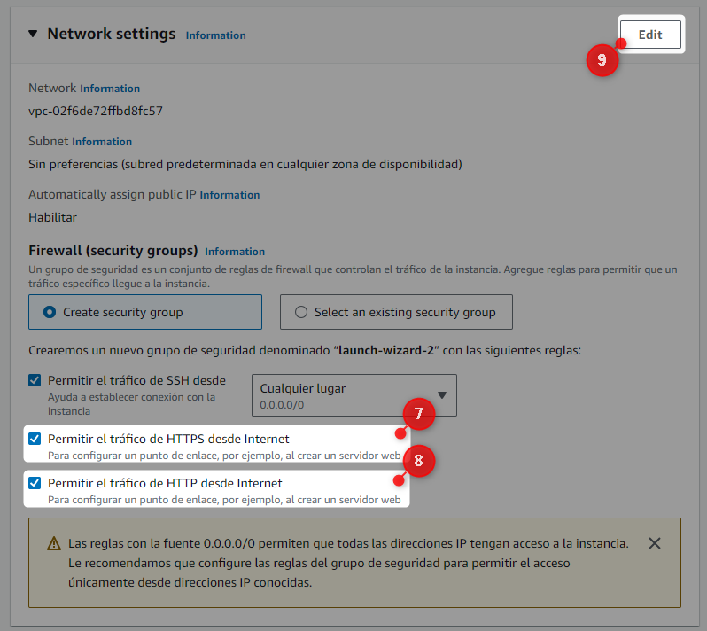

A continuación, haz clic en **“Add security group rule”** para agregar los puertos necesarios para MQTT:

- **Puerto 1883 (TCP)**: se utiliza para la conexión MQTT del **ESP32-C6** hacia el broker Mosquitto.
- **Puerto 9001 (TCP)**: se utiliza para la conexión del **dashboard web** mediante **MQTT sobre WebSocket**.

En ambos casos se puede dejar el origen como `0.0.0.0/0` para permitir el acceso desde cualquier IP

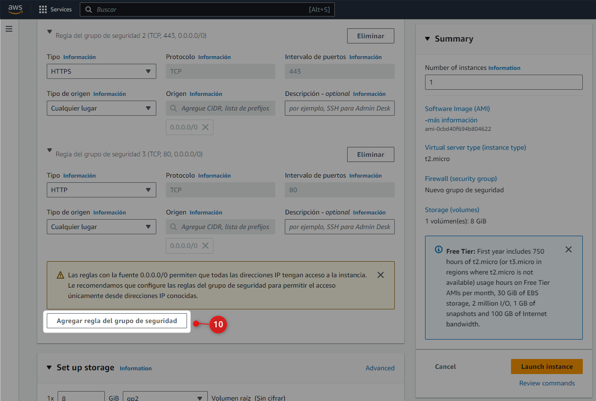

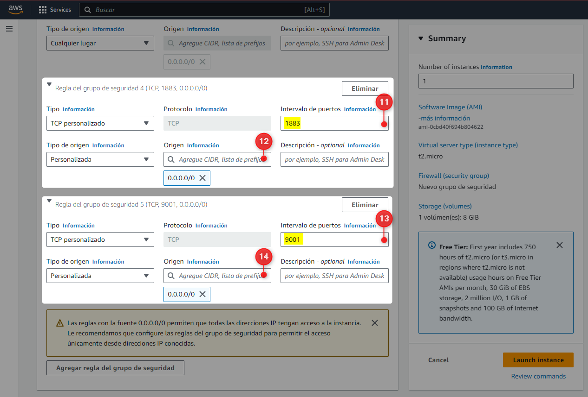

**1.4 Configuración del par de claves (Key pair)**

En el apartado **“Key pair (login)”** se debe crear o seleccionar un **par de claves (key pair)**. 

Un key pair es un mecanismo de autenticación que utiliza una **clave pública** (que queda almacenada en la instancia EC2) y una **clave privada** (que se descarga en tu computador) para permitir el acceso seguro por SSH, sin necesidad de usar una contraseña.

Al crear un nuevo key pair, AWS generará un archivo con extensión **`.pem`**, el cual se descargará automaticamente y se debe guardar en un lugar seguro.  

Este archivo `.pem` será necesario si se va a acceder a la instancia EC2 como cliente **SSH** desde **Windows PowerShell** (o desde cualquier otro cliente SSH).

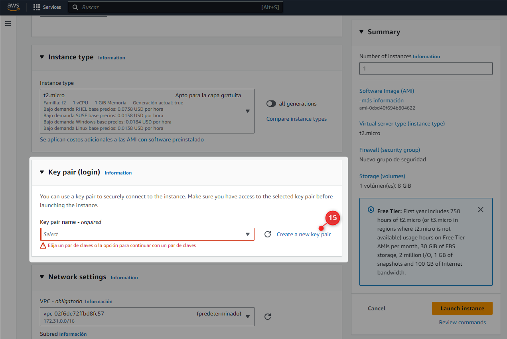

 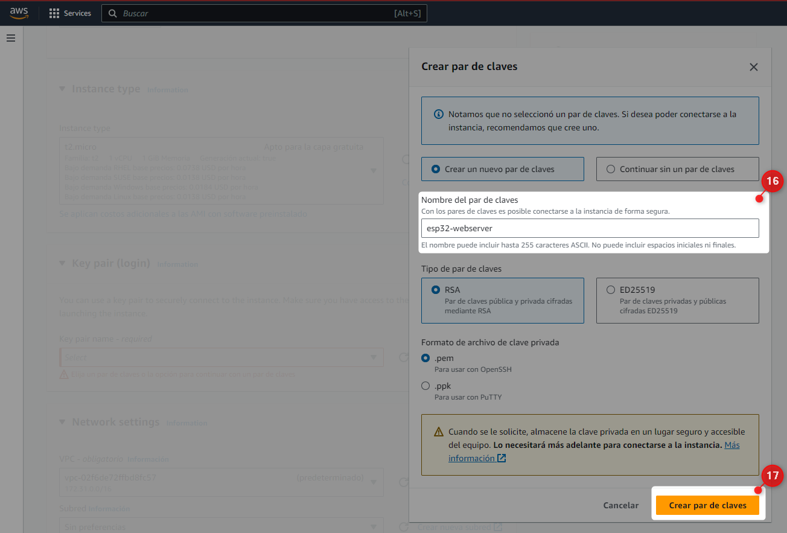

 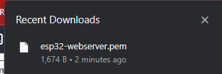

**1.5 Inicio de la instancia**

Finalmente, después de revisar la configuración anterior, se hace clic en **“Launch instance”** para crear la máquina virtual.  

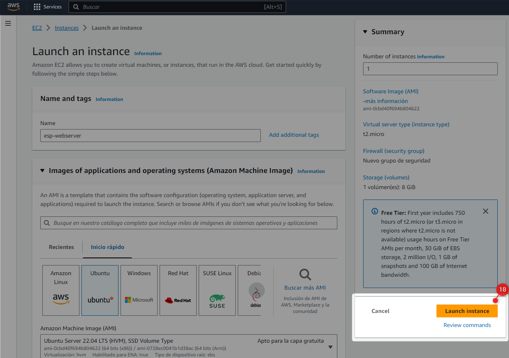

Luego, en la sección “Instances”, se selecciona (se marca) la instancia creada y, si es necesario, se elige la opción **“Instance state” → “Start instance”** para asegurarse de que esté encendida

Desde el panel de EC2 se verifica que el estado de la instancia cambie a **“running”**, lo que indica que el servidor está encendido y listo para aceptar conexiones.


Una vez la instancia está en ejecución, ya es posible acceder por **SSH** al servidor y continuar con la configuración del **broker MQTT (Mosquitto)** dentro de esta máquina virtual.

## 2. Configuración del broker MQTT y Apache2 dentro del servidor AWS (EC2)

**2.1 Acceso por SSH a la instancia EC2**

Desde **Windows**, abre **PowerShell** en la carpeta donde guardaste el archivo `.pem` del key pair. 

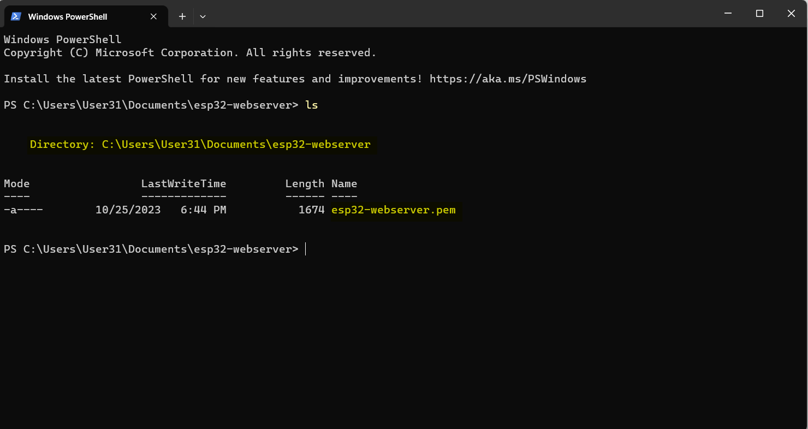

Una vez la instancia está en estado **“running”**, en el panel de EC2 se hace clic en el botón **“Connect”**.  
En la ventana que se abre, se selecciona la opción **“SSH client”** y, en la parte inferior, en la sección **“Example”**, aparece el comando completo para conectarse por SSH a la instancia. Es un comando similar a:

```bash
ssh -i "NOMBRE_DE_TU_CLAVE.pem" ubuntu@IP_PUBLICA_DE_LA_INSTANCIA
```

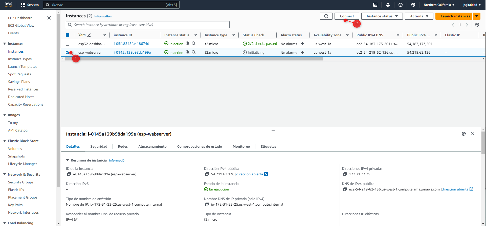

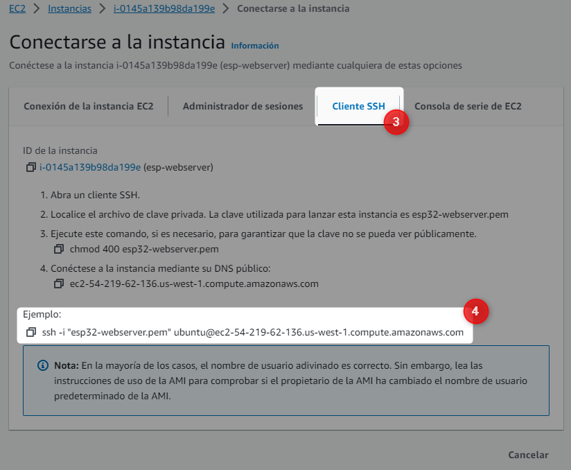

Este comando se debe copiar y ejecutar en Windows PowerShell, ubicándose primero en la carpeta donde se encuentra el archivo .pem.

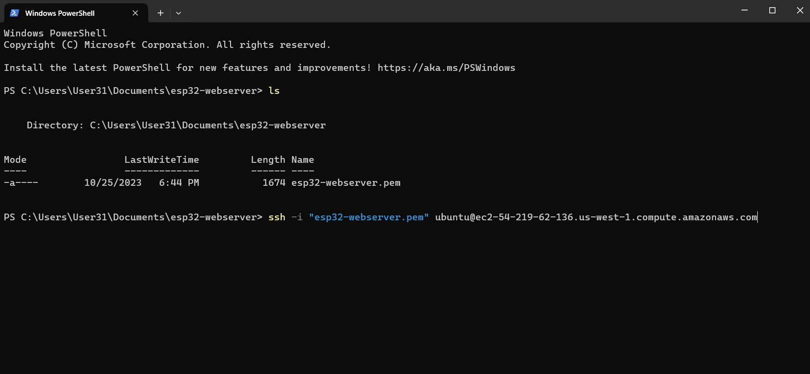

De esta forma, se establece la conexión SSH con el servidor Ubuntu que está corriendo en la instancia EC2.

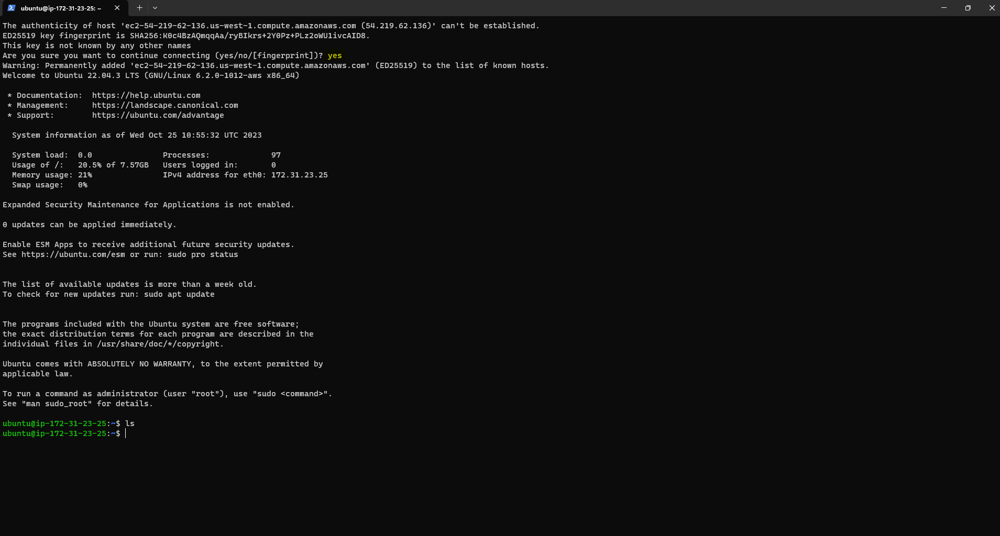

**2.2 Instalación de apache2**

```bash
sudo apt update
sudo apt install apache2
```

Se debe asegúrar de que Apache esté en ejecución. Puede verificar su estado con el siguiente comando:

```bash

sudo systemctl status apache2

```

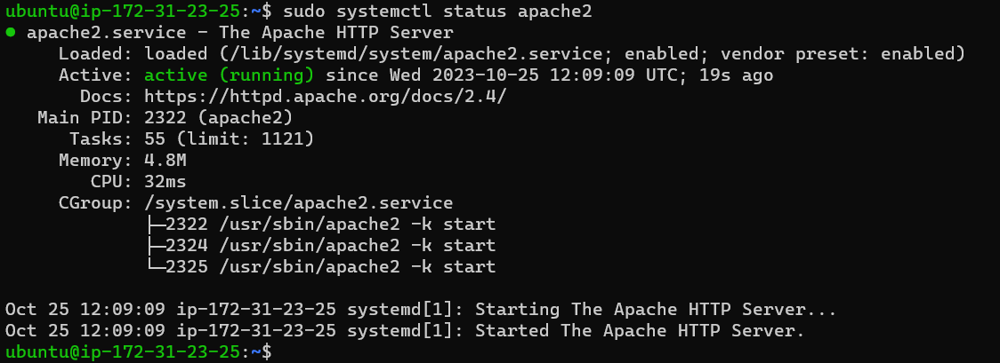

Si Apache no se está ejecutando, se debe iniciar el servicio con:

```bash

sudo systemctl start apache2

```

**2.3 Instalación de Mosquitto**

Los siguientes comandos actualizarán la lista de paquetes disponibles y luego instalarán el servidor Mosquitto y la utilidad de línea de comandos Mosquitto Clients.

```bash

sudo apt update
sudo apt install mosquitto mosquitto-clients

```
Una vez que Mosquitto esté instalado, se puede habilitar el servicio y se debe de asegurar de que se inicie automáticamente al arrancar el sistema con los siguientes comandos:

```bash

sudo systemctl enable mosquitto
sudo systemctl start mosquitto

```

Para verificar si Mosquitto se está ejecutando correctamente ejecutando el siguiente comando:

```bash

sudo systemctl status mosquitto

```

Se deberia ver un mensaje que indique que el servicio está activo y en funcionamiento.

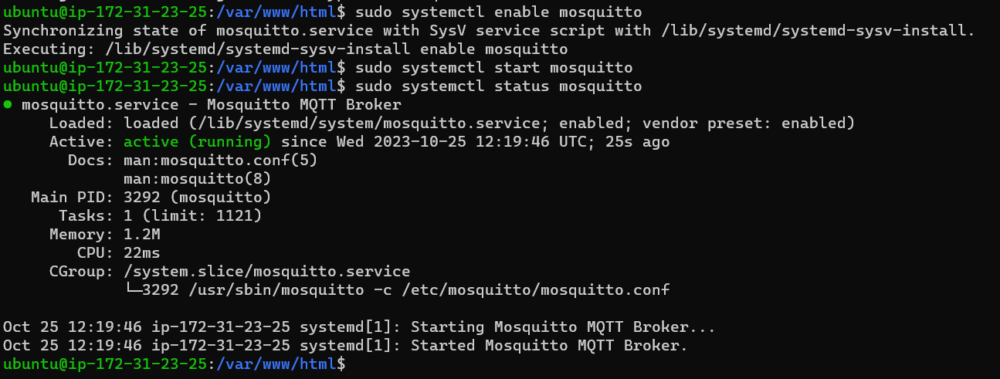

**2.4 Configuración de los puertos 1883 y 9001 (WebSocket)**

Por defecto, Mosquitto suele escuchar en el puerto 1883 (MQTT sobre TCP).
Para esta práctica también se configurará el puerto 9001 para MQTT sobre WebSocket, que usará el dashboard web.

Primero, se edita el archivo de configuración (por ejemplo):

```bash

sudo nano /etc/mosquitto/conf.d/mosquitto.conf

```

Y se agrega el siguiente contenido básico:

```bash

# Listener MQTT normal (ESP32-C6)
listener 1883
protocol mqtt

# Listener MQTT sobre WebSocket (dashboard web)
listener 9001
protocol websockets

```

Se guarda el archivo (Ctrl + O, Enter) y se sale del editor (Ctrl + X).

**2.5 Crear un archivo de contraseñas:**

- Abrir una terminal y ejecuta el siguiente comando para crear un archivo que almacene los usuarios y contraseñas:

```bash

sudo mosquitto_passwd -c /etc/mosquitto/passwd <nombre-de-usuario>

```

Reemplazar **`<nombre-de-usuario>`** con el nombre de usuario que  se desee. Será solicitado a ingresar una contraseña para ese usuario.

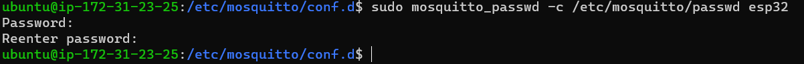

```bash
sudo chown mosquitto:mosquitto /etc/mosquitto/passwd
sudo chmod 640 /etc/mosquitto/passwdclear
```

**2.6 Reiniciar el servidor Mosquitto para que los cambios surtan efecto:**

Finalmente, se reinicia Mosquitto para que tome la nueva configuración:

```bash

sudo systemctl restart mosquitto

```

Ahora, cuando te conectes al servidor MQTT Mosquitto, deberás proporcionar un nombre de usuario y contraseña válidos para autenticarte.

En este punto, el servidor AWS EC2 ya tiene un broker MQTT escuchando en:

- 1883/TCP para el ESP32-C6.

- 9001/TCP (WebSocket) para el dashboard web.

**2.7 Prueba el Servidor**

Puedes utilizar el cliente Mosquitto para probar la funcionalidad del servidor MQTT. Abre una terminal y utiliza el siguiente comando para suscribirte a un tema y ver los mensajes que llegan:

```bash

mosquitto_sub -h localhost -t test -u esp32 -P esp32
musqu

```

Abrir otra terminal y publica un mensaje en el mismo tema:

```bash

mosquitto_pub -h localhost -t test -m "Hola, MQTT!" -u esp32 -P esp32

#

```

Deberías ver el mensaje "Hola, MQTT!" en la terminal donde te suscribiste al tema.

## 3. Creación del dashboard web

Por convención, las páginas web se almacenan en el directorio **/var/www/hmtl**. se puede utilizar este directorio para una página web sencilla. Lo mejor es crear un directorio para el sitio y cambiar los permisos para que se pueda editar los archivos:

```bash
sudo mkdir /var/www/html/
sudo chown -R tu_usuario:tu_usuario /var/www/html/
```

Reemplaza **`tu_usuario`** con su nombre de usuario.


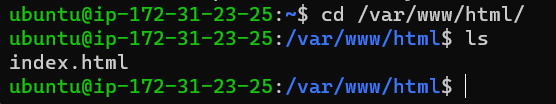

Para  la aplicacion a desarrollar  se debe colocar este  codigo HTML de la parte web para  vizualizacion  de la informacion, este se coloca en la siguiente ruta:

```bash

sudo nano /var/www/html/index.html

```

**Contenido del archivo:**
```html
<!DOCTYPE html>
<html lang="es">
<head>
  <meta charset="UTF-8">
  <title>Monitor de Parqueadero IoT</title>
  <style>
    body {
      font-family: Arial, sans-serif;
      text-align: center;
      margin-top: 40px;
    }

    #circle {
      width: 120px;
      height: 120px;
      border-radius: 50%;
      background: #222;
      margin: 0 auto 20px auto;
      box-shadow: 0 0 20px #888;
      transition: background 0.5s;
    }

    #status {
      margin: 20px 0;
      font-weight: bold;
    }

    .connected { color: green; }
    .disconnected { color: red; }
    .connecting { color: orange; }

    #summary {
      margin: 15px 0;
    }

    #parkingContainer {
      display: flex;
      flex-wrap: wrap;
      justify-content: center;
      gap: 10px;
      margin-top: 20px;
    }

    .spot {
      width: 80px;
      height: 80px;
      border-radius: 8px;
      border: 1px solid #333;
      display: flex;
      flex-direction: column;
      align-items: center;
      justify-content: center;
      font-size: 14px;
      font-weight: bold;
      color: #000;
    }

    .spot.free {
      background-color: #8cff8c; /* verde claro */
    }

    .spot.occupied {
      background-color: #ff7b7b; /* rojo claro */
    }

    .spot span {
      font-size: 12px;
      font-weight: normal;
    }
  </style>
</head>
<body>
  <h2>Monitor de Parqueadero IoT - ESP32-C6</h2>

  <!-- Indicador global tipo semáforo -->
  <div id="circle"></div>

  <div id="status" class="connecting">Conectando a MQTT...</div>

  <div id="summary">
    Estado global: <span id="globalState">---</span><br>
    Plazas ocupadas: <span id="occupiedCount">0</span> /
    <span id="totalSpots">0</span><br>
    Mensajes recibidos: <span id="messageCount">0</span>
  </div>

  <!-- Contenedor de las plazas -->
  <div id="parkingContainer"></div>

  <script src="https://cdnjs.cloudflare.com/ajax/libs/paho-mqtt/1.0.1/mqttws31.min.js"></script>
  <script>
    window.onload = function() {
      const brokerHost = "IP_PUBLICA_SERVER"; // CAMBIAR  LA IP
      const brokerPort = 9001;           // Puerto WebSocket
      const topic = "esp32/parking";     // 🔹 NUEVO TOPIC
      const username = "esp32"; //COLOCAR TU USUARIO PARA ACCESO MQTT
      const password = "esp32"; //COLOCAR TU CONTRASEÑA PARA ACCESO MQTT

      // Colores del círculo global
      const globalColorMap = {
        free:  "#00ff00", // todo libre
        full:  "#ff0000", // todo ocupado
        mixed: "#0000ff"  // parcialmente ocupado
      };

      let messageCount = 0;

      // Crear cliente MQTT de Paho
      let client = new Paho.MQTT.Client(
        brokerHost,
        brokerPort,
        "webclient_" + Math.random().toString(16).substr(2, 8)
      );

      client.onConnectionLost = function(responseObject) {
        console.log("Conexión perdida: " + responseObject.errorMessage);
        document.getElementById('status').textContent = "Desconectado de MQTT";
        document.getElementById('status').className = "disconnected";
      };

      client.onMessageArrived = function(message) {
        console.log("Mensaje recibido: " + message.payloadString);

        // Incrementamos contador de mensajes
        messageCount++;
        document.getElementById('messageCount').textContent = messageCount;

        let data;
        try {
          data = JSON.parse(message.payloadString);
        } catch (e) {
          console.error("Error al parsear JSON:", e);
          return;
        }

        const spots = data.spots || [];
        const totalSpots = spots.length;
        document.getElementById('totalSpots').textContent = totalSpots;

        // Limpiar contenedor
        const container = document.getElementById('parkingContainer');
        container.innerHTML = "";

        // Contar ocupadas y dibujar cada plaza
        let occupiedCount = 0;
        spots.forEach(spot => {
          const div = document.createElement("div");
          div.className = "spot " + (spot.status === "occupied" ? "occupied" : "free");

          if (spot.status === "occupied") occupiedCount++;

          div.innerHTML = `
            P${spot.id}<br>
            <span>${spot.status === "occupied" ? "OCUPADA" : "LIBRE"}</span>
          `;

          container.appendChild(div);
        });

        document.getElementById('occupiedCount').textContent = occupiedCount;

        // Actualizar estado global y círculo según ocupación
        let globalStateText = "---";
        let circleColor = "#222";

        if (totalSpots > 0) {
          if (occupiedCount === 0) {
            globalStateText = "TODO LIBRE";
            circleColor = globalColorMap.free;
          } else if (occupiedCount === totalSpots) {
            globalStateText = "PARQUEADERO LLENO";
            circleColor = globalColorMap.full;
          } else {
            globalStateText = "OCUPACIÓN PARCIAL";
            circleColor = globalColorMap.mixed;
          }
        }

        document.getElementById('globalState').textContent = globalStateText;
        document.getElementById('circle').style.background = circleColor;
      };

      const connectOptions = {
        userName: username,
        password: password,
        timeout: 10,
        keepAliveInterval: 30,
        onSuccess: function() {
          console.log("Conectado exitosamente a MQTT broker");
          document.getElementById('status').textContent = "Conectado a MQTT";
          document.getElementById('status').className = "connected";
          client.subscribe(topic);
          console.log("Suscrito al topic: " + topic);
        },
        onFailure: function(error) {
          console.log("Error de conexión: " + error.errorMessage);
          document.getElementById('status').textContent =
            "Falló la conexión MQTT: " + error.errorMessage;
          document.getElementById('status').className = "disconnected";
        }
      };

      console.log("Intentando conectar a: " + brokerHost + ":" + brokerPort);
      client.connect(connectOptions);
    };
  </script>
</body>
</html>
```

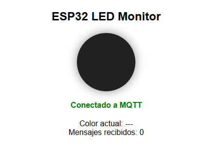

* Ir a ```http://IP_PUBLICA_SERVER/index.html ```
* Debería mostrar la página con estado "Conectando a MQTT..."

## 4. Configuración del Proyecto ESP32

#### 4.1 Prerequisitos

- **ESP-IDF v5.5** instalado
- **ESP32-C6-DevKitC-1 v1.2**
- **Cable USB-C**

#### 4.2 Estructura del Proyecto

El proyecto ya está configurado con los archivos necesarios:

```
main/
├── CMakeLists.txt           # Configuración de dependencias
├── idf_component.yml        # Dependencia led_strip
├── Kconfig.projbuild        # Configuración del proyecto
└── station_example_main.c   # Código principal
```

#### 4.3 Configurar Variables en el Código

Editar `main/station_example_main.c` y cambiar las siguientes líneas:

```c
// Configuración WiFi - CAMBIAR POR SUS DATOS
#define EXAMPLE_ESP_WIFI_SSID      "RED_WIFI"
#define EXAMPLE_ESP_WIFI_PASS      "PASSWORD_WIFI"

// Configuración MQTT - CAMBIAR POR SU IP
#define MQTT_BROKER_URL "mqtt://_IP_PUBLICA_SERVER:1883"
```

**IMPORTANTE**: Reemplazar:
- `RED_WIFI`: Nombre de su red WiFi
- `PASSWORD_WIFI`: Contraseña de su red WiFi  
- `IP_PUBLICA_SERVER`: IP pública de su servidor AWS EC2

#### 4.4 Compilar y Flashear

```bash
# Configurar target para ESP32-C6
idf.py set-target esp32c6

# Compilar
idf.py build

# Conectar ESP32 por USB y flashear
idf.py flash

# Monitor serial para ver logs
idf.py monitor
```

#### 4.5 Configuración de Red (opcional)

Si prefiere configurar WiFi mediante menuconfig:

```bash
idf.py menuconfig
```

Navegar a: **Example Configuration** y establecer:
- WiFi SSID
- WiFi Password

---

##  Verificación del Sistema

### 1. Verificar ESP32

**En el monitor serial (`idf.py monitor`) en serial monitor debería ver:**
```
---- Opened the serial port COM12 ----
I (18161) LED: Encendiendo LED RGB color: green
I (18161) PARKING: Publicado mensaje 5, msg_id=30740: {"device_id":"esp32c6_parking_1","msg_id":5,"spots":[{"id":1,"status":"free"},{"id":2,"status":"free"},{"id":3,"status":"free"},{"id":4,"status":"free"}]}
I (21171) LED: Encendiendo LED RGB color: green
I (21171) PARKING: Publicado mensaje 6, msg_id=38530: {"device_id":"esp32c6_parking_1","msg_id":6,"spots":[{"id":1,"status":"free"},{"id":2,"status":"free"},{"id":3,"status":"free"},{"id":4,"status":"free"}]}
I (24181) LED: Encendiendo LED RGB color: green
I (24181) PARKING: Publicado mensaje 7, msg_id=62060: {"device_id":"esp32c6_parking_1","msg_id":7,"spots":[{"id":1,"status":"free"},{"id":2,"status":"free"},{"id":3,"status":"free"},{"id":4,"status":"free"}]}

```

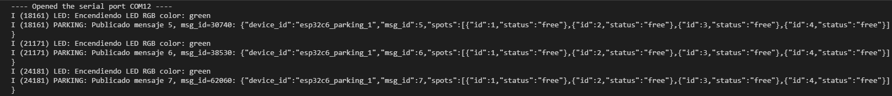

**debe comprobar:**

El ESP32-C6:

- Se conecta correctamente al WiFi (SSID y IP obtenida).
- Se conecta al broker MQTT sin errores.

Cada ~3 segundos:

- Se simula algún cambio en las plazas (Plaza X ahora está OCUPADA/LIBRE).
- Se publica un JSON en el topic esp32/parking con el estado de todas las plazas.

**LED RGB físico debe:**

El LED actúa como indicador global del parqueadero:

- Verde → Todas las plazas libres.
- Rojo → Parqueadero lleno (todas ocupadas).
- Azul → Ocupación parcial (unas libres y otras ocupadas).


### 2. Verificar Servidor MQTT (Mosquitto en AWS)

En el servidor AWS (donde corre Mosquitto), suscríbetase al topic del parqueadero:

```bash
# En el servidor AWS, monitorear mensajes en tiempo real del parqueadero
mosquitto_sub -h localhost -t esp32/parking -u esp32 -P esp32
```

**Debería ver mensajes JSON como:**
```
{"device_id":"esp32c6_parking_1","msg_id":1,"spots":[{"id":1,"status":"free"},{"id":2,"status":"free"},{"id":3,"status":"free"},{"id":4,"status":"free"}]}
{"device_id":"esp32c6_parking_1","msg_id":2,"spots":[{"id":1,"status":"free"},{"id":2,"status":"free"},{"id":3,"status":"free"},{"id":4,"status":"free"}]}
{"device_id":"esp32c6_parking_1","msg_id":3,"spots":[{"id":1,"status":"free"},{"id":2,"status":"free"},{"id":3,"status":"free"},{"id":4,"status":"free"}]}
...
```

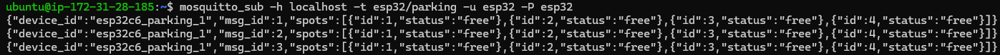

**Debe comprobar:**

- Llegan mensajes cada ~3 segundos.
- El campo msg_id va incrementando.
- Los estados status cambian entre "free" y "occupied" de forma coherente.

### 3. Verificar Página Web (Gemelo Digital de Parqueadero)

**3.1 Abrir en el navegador:**

```
http://TU_IP_PUBLICA/index.html
```

**3.2 En la página debería ver:**

- **Estado MQTT:**
   - Texto "Conectado a MQTT" en color verde.

- **Indicador global (círculo):**
   - Verde cuando todas las plazas están libres.
   - Rojo cuando todas están ocupadas.
   - Azul cuando hay ocupación parcial.

- **Resumen numérico:**
   - Plazas ocupadas: X / Y
   - Mensajes recibidos: N (debe ir aumentando).

- **Tarjetas de plazas:**

Cada plaza aparece como un recuadro

 - Verde y texto LIBRE cuando status = "free"
 - Rojo y texto OCUPADA cuando status = "occupied".

### **Comportamiento esperado:**

- Cada vez que el ESP32-C6 publica un nuevo JSON:
   - El contador de “Mensajes recibidos” aumenta.
   - Algunas plazas cambian de color/estado (simulación de entrada/salida de vehículos).
   - El círculo global actualiza su color según la cantidad de plazas ocupadas.

### **Ejemplo de evento 4 plazas ocupadas**
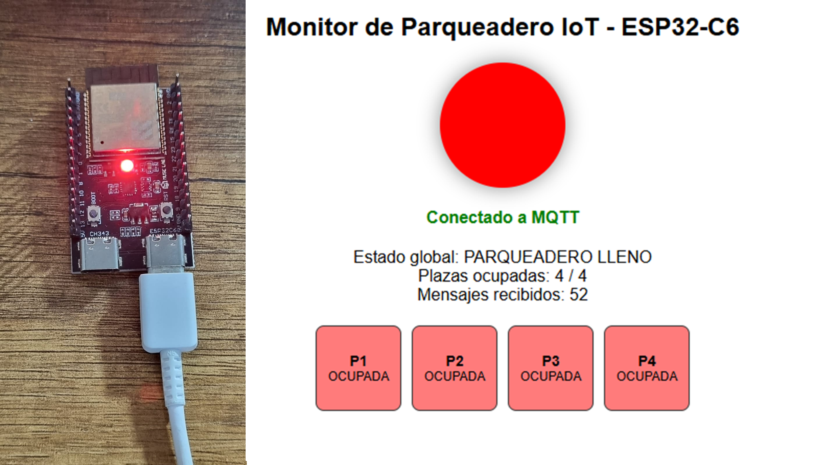

### **Ejemplo de evento 3 plazas libres y 1 ocupada**
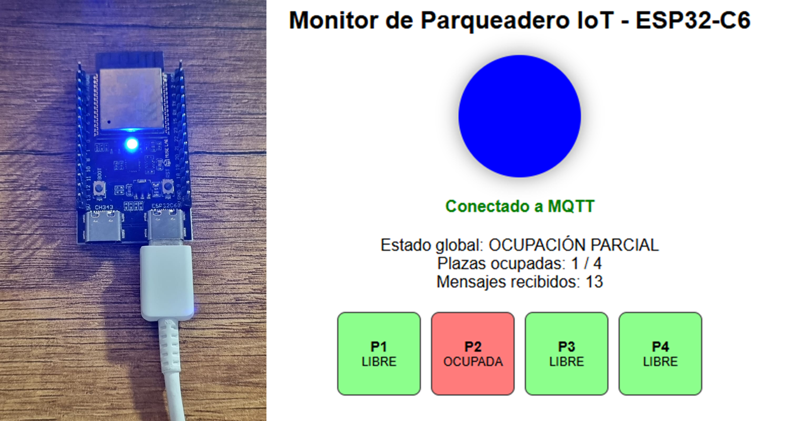

### **Ejemplo de evento 4 plazas libres**
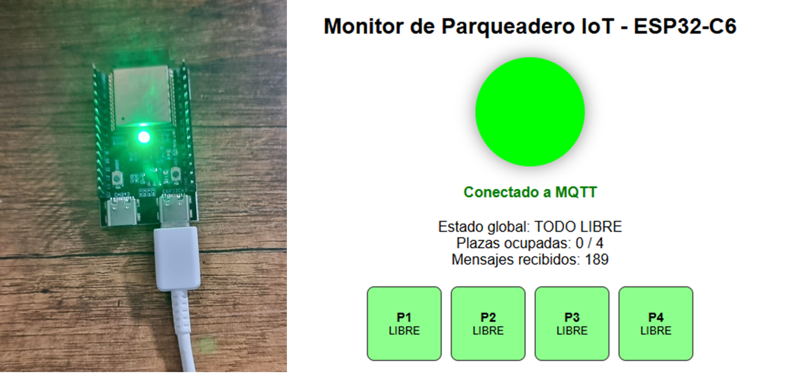
 
## Diagrama de Flujo del Sistema

```
Inicio
  ↓
Inicializar NVS
  ↓
Conectar WiFi
  ↓
Inicializar LED RGB (indicador global del parqueadero)
  ↓
Conectar MQTT
  ↓
Crear Tarea de Parqueadero
  ↓
Loop infinito (tarea de parqueadero):
├─ Simular estado de las plazas (libre/ocupado)
├─ Actualizar LED RGB según ocupación:
│ - Verde → todas libres
│ - Rojo → todas ocupadas
│ - Azul → ocupación parcial
├─ Construir mensaje JSON con:
│ - device_id
│ - msg_id (contador de mensajes)
│ - listado de plazas: id + status (free/occupied)
├─ Publicar JSON por MQTT en el topic esp32/parking
├─ Esperar 3 segundos
└─ Repetir ciclo
```

---

### Servidor
- **Cloud Provider**: AWS EC2
- **OS**: Ubuntu 22.04 LTS
- **Broker MQTT**: Mosquitto
- **Web Server**: Apache2
- **Puertos**: 22 (SSH), 80 (HTTP), 1883 (MQTT), 9001 (WebSocket)

---


